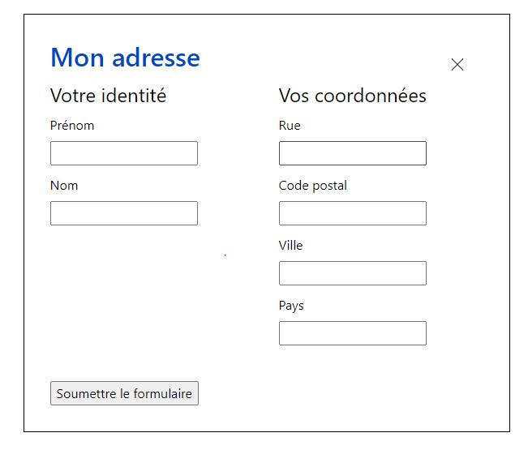

# A11y exercice - Le piège au focus

## Installation du projet

```bash
# install node_modules
npm install


# DEV: first do gulp scripts and then gulp
gulp scripts
gulp

# PROD: first do gulp scripts and then gulp compile --prod
gulp scripts --prod
gulp compile --prod

```

## Objectif:

Piéger le focus à l'intérieur d'une fenêtre de dialogue modale contenant:

- un bouton "close"
- un formulaire accessible (ce formulaire est "faux" et ne renvoie nulle part)

L'ouverture de la modale se fait par un bouton _Ouvrir_.

</br>

## Formulaire:

```
Le formulaire doit être accessible.
Les champs sont groupés en deux catégories Votre identité et Vos coordonnées.
Le bouton submit ne renvoie nulle part.
```



</br>

## Actions:

1.  Le bouton doit indiquer à l'utilisateur par un label (Aria ou autre) quelle sera son action.
2.  Action du bouton (click ou touche _enter_): ouverture de la fenêtre de dialogue
3.  A l'ouverture, le focus est passer au premier élément du formulaire de la fenêtre.
4.  A la tabulation, l'utilisateur ne peut pas sortir de la fenêtre.
5.  Fermeture de la fenêtre: click sur bouton close ou touche _escape_.  
    **Optionnel**: le "click" sur le backdrop ferme aussi la fenêtre
6.  Après fermeture de la fenêtre: le focus est redonné au bouton _Ouvir_

**La sémantique HTML/ARIA des _bouton, fenêtre et formulaire_ doit être conforme au recommandation du WCAG.**

</br>

## Classes:

- _base-modal--show_ : fais apparaitre la modal ainsi que le backdrop (fond opaque)

</br>

## Documentation:

- [Notice Accede-web: formulaires](https://www.accede-web.com/notices/html-et-css/formulaires/)
- [Notice Accede-web: modales](https://www.accede-web.com/notices/interface-riche/fenetres-modales)
- [Javascript: Keydown events](https://developer.mozilla.org/en-US/docs/Web/API/Document/keydown_event)
- [Javascript: focus](https://developer.mozilla.org/en-US/docs/Web/API/HTMLOrForeignElement/focus)
- [Méthodologie BEM CSS](http://getbem.com/introduction/)

</br>
